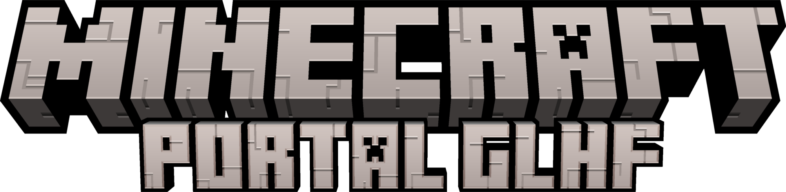

# Portal GLHF - Servidor dos Subs

Bem vindo ao servidor de minecraft para subs.

As regras do servidor são as seguintes:

1. Respeite os outros jogadores. Sejam Educados e vamos criar uma comunidade da hora.
2. Nada de preconceito de qualquer forma ou tamanho. (Caso aconteça será ban imediato do Server).
3. Respeite items e áreas de outros jogadores, nunca pegue algo de alguém sem autorização. Infrações vão ser punidas.
    - Pensem sempre no próximo quando estiver jogando, não deixar buracos de creeper, reparem o que for destruído, tentem ajudar se possível para que o server tenha uma comunidade top do top.
4. Lembre de manter o sub em dia pra não perder o acesso ao server.
5. Qualquer tipo de grief (Roube de itens, destruição, modificação de coisa alheia sem permissão, etc) será ban do server e o tempo do ban será analisado caso a caso.

Lembrando que em qualquer caso de ban no servidor o mesmo será levado ao discord e live. Não importando se a pessoa vai manter ou não o sub.

Os seguintes datapacks, resource packs e mods são utilizados no servidor PGLHF de minecraft. Todos essas modificações não modificam (drasticamente) a experiência vanila, sendo o intuito melhora-lá.

- [Datapacks](#datapacks)

## Datapacks

A maioria dos datapacks a seguir foram adiquiridos no [vanilla tweaks](https://vanillatweaks.net/picker/datapacks/).

- Survival
  
Datapak | Explicação |  
:------------ | :----------- |
AFK Display   | Ao precionar "tab" para abrir a lista de players logados, os players que estiverem sem atividade por mais de 5 minutos estarão com seus nicknames em cinza. |
Armor Statues | Adiciona um livro que permite personalizar as propriedades dos 'Armor Stand' da forma que desejar. Para adiquirir esse livro, craft um livro e como título do livro use "Statues". |
Coordinates HUD | Adiciona as informações de coordenadas `X Y Z` e a hora (24hr) no mundo.
Custom Nether Portals| |
Durability Ping | |
